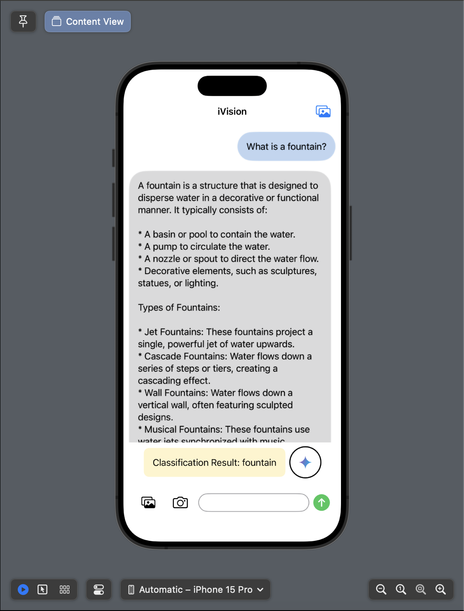

Certainly! Here's a README file template for your SwiftUI application "iVision":

---

# iVision: Apple Vision Assistant

iVision is an iOS app that integrates image classification using CoreML and Google Generative AI (Gemini) for generating responses based on user queries and images.

## Features

- **Image Classification**: Uses CoreML with MobileNetV2 for image classification.
- **Text-based Interaction**: Communicate with Gemini to get responses based on user queries.
- **Camera and Photo Library Integration**: Allows users to capture or select images for classification and interaction.
- **Integration with Google Generative AI**: Engages Gemini for generating responses based on user queries and uploaded images.

## Screenshots

## How to Use

1. **API Key Setup**: Replace `"YOUR_API_KEY"` in `ContentView.swift` with your Google Generative AI API key. Ensure you have permissions and keep your API key secure.

2. **Run the App**: Open the project in Xcode and run the app on an iOS simulator or device.

3. **Interact with iVision**:
   - **Image Classification**: Tap on the photo library or camera icons to upload an image for classification.
   - **Text Queries**: Type your query in the text field and tap the send button to interact with Gemini.

4. **View Responses**: Classification results and Gemini responses will appear in the chat interface.

## Author

- **Author**: Syed Nabiel Hasaan M.
- **Email**: msyednabiel@gmail.com

## Notes

- This app demonstrates integration of CoreML for image classification and Google Generative AI for text generation.
- Ensure proper handling of user data and permissions in compliance with Apple's guidelines.

## License

This project is licensed under the MIT License - see the [LICENSE](LICENSE) file for details.
